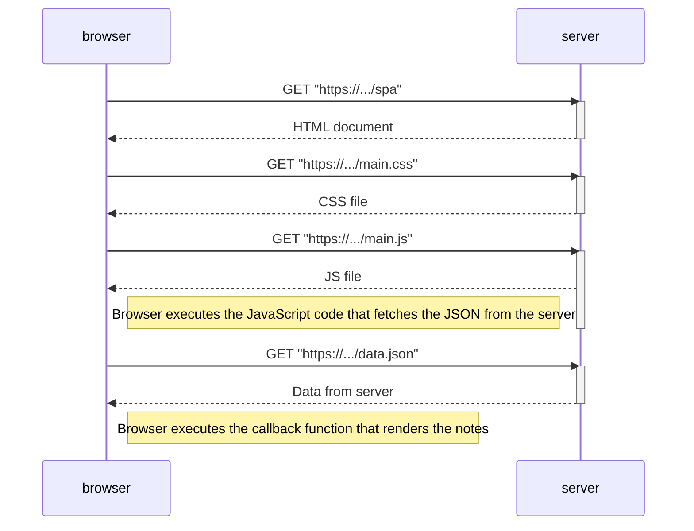

```mermaid
sequenceDiagram
    participant browser
    participant server

    browser->>server: GET "https://.../spa"
    activate server
    server-->>browser: HTML document
    deactivate server

    browser->>server: GET "https://.../main.css"
    activate server
    server-->>browser: CSS file
    deactivate server

    browser->>server: GET "https://.../main.js"
    activate server
    server-->>browser: JS file
    Note right of browser: Browser executes the JavaScript code that fetches the JSON from the server
    deactivate server

    browser->>server: GET "https://.../data.json"
    activate server
    server-->>browser: Data from server
    deactivate server

    Note right of browser: Browser executes the callback function that renders the notes


```