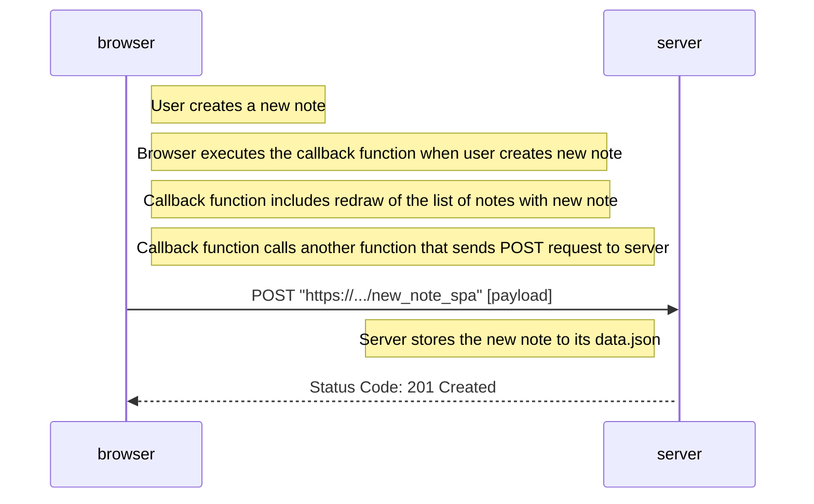

```mermaid
sequenceDiagram
    Note right of browser: User creates a new note

    Note right of browser: Browser executes the callback function when user creates new note
    Note right of browser: Callback function includes redraw of the list of notes with new note
    Note right of browser: Callback function calls another function that sends POST request to server

    browser->>server: POST "https://.../new_note_spa" [payload]
    activate server
    Note left of server: Server stores the new note to its data.json
    server-->>browser: Status Code: 201 Created

```