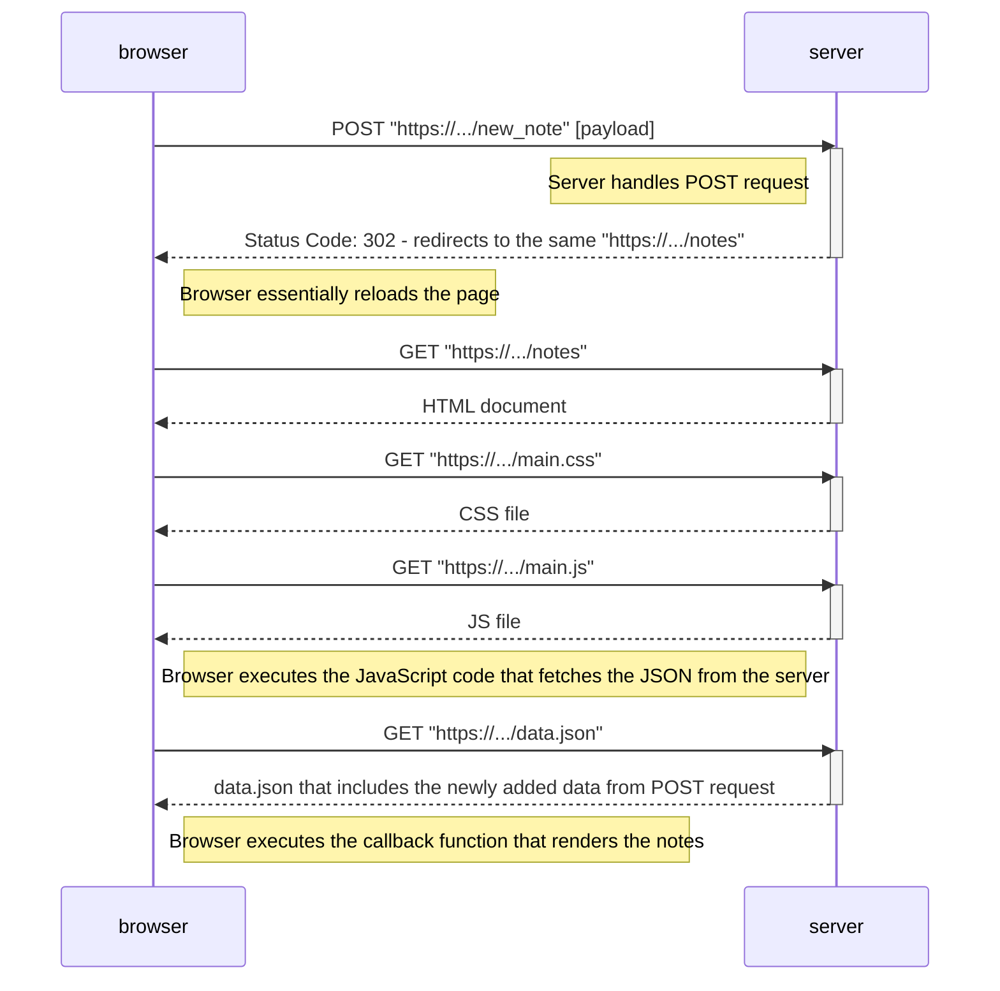

```mermaid

sequenceDiagram
    participant browser
    participant server

    browser->>server: POST "https://.../new_note" [payload]
    activate server
    Note left of server: Server handles POST request
    server-->>browser: Status Code: 302 - redirects to the same "https://.../notes"
    deactivate server

    Note right of browser: Browser essentially reloads the page
    browser->>server: GET "https://.../notes"
    activate server
    server-->>browser: HTML document
    deactivate server

    browser->>server: GET "https://.../main.css"
    activate server
    server-->>browser: CSS file
    deactivate server

    browser->>server: GET "https://.../main.js"
    activate server
    server-->>browser: JS file
    deactivate server

    Note right of browser: Browser executes the JavaScript code that fetches the JSON from the server

    browser->>server: GET "https://.../data.json"
    activate server
    server-->>browser: data.json that includes the newly added data from POST request
    deactivate server

    Note right of browser: Browser executes the callback function that renders the notes

```